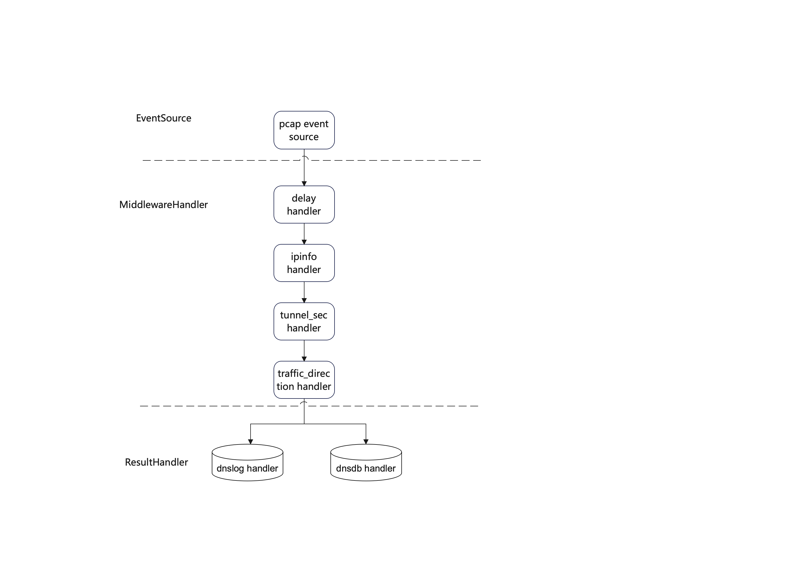

# design
## 背景
* 存在众多项目使用开源DNS，替换时无业务量评估依据，有业务流量评估工具需求
* 众多DNS Server不支持出向递归日志，故障排查时需要通过抓包的方法进行，排障困难
* 通过对结构化的DNS事件分析统计，输出用户DNS请求行为画像及DNS行为基线

## 目标
* 支持输出DNS日志、结构化数据写入数据库（duckdb）
* 支持离线抓包文件解析和指定网卡实时抓包解析
* 支持对输入源数据进行过滤
* 支持输出的日志文件轮滚及数据库文件轮滚
* 支持加载IP信息库，为DNS事件补充关键IP属性（地理位置、应用名称等）
* 支持为DNS事件补充隧道安全相关属性（域名长度、子域名长度、子域名信息熵等）

## 设计
程序大致分为如下模块：
* EventSource: DNS事件源，生产DNS事件
* Handler: DNS事件处理者，具体分为两类
    * MiddlewareHandler: 中间处理者，为DNS事件补充相关属性
    * ResultHandler: 结果处理者，将DNS事件输出至日志文件或数据库，或进行相关统计并输出统计结果

其中EventSource和MiddlewareHandler两部分支持线程池并行执行
> delay handler因会话表匹配要求DNS事件时序无法并行执行

系统总体架构：


### EventSource
DNS事件结构体定义：
```go
type DnsEvent struct {
	// 常规属性
	EventTime            time.Time `json:"EventTime"`
	SourceIP             string    `json:"SourceIP"`
	SourcePort           uint16    `json:"SourcePort"`
	DestinationIP        string    `json:"DestinationIP"`
	DestinationPort      uint16    `json:"DestinationPort"`
	TranscationID        uint16    `json:"TranscationID"`
	View                 string    `json:"View"`
	Domain               string    `json:"Domain"`
	QueryClass           string    `json:"QueryClass"`
	QueryType            string    `json:"QueryType"`
	Rcode                string    `json:"Rcode"`
	Response             bool      `json:"Response"`
	Authoritative        bool      `json:"Authoritative"`
	Truncated            bool      `json:"Truncated"`
	RecursionDesired     bool      `json:"RecursionDesired"`
	RecursionAvailable   bool      `json:"RecursionAvailable"`
	Zero                 bool      `json:"Zero"`
	AuthenticatedData    bool      `json:"AuthenticatedData"`
	CheckingDisabled     bool      `json:"CheckingDisabled"`
	DelayMicrosecond     int64     `json:"DelayMicrosecond"`
	Answer               []RR      `json:"Answer"`
	Authority            []RR      `json:"Authority"`
	Additional           []RR      `json:"Additional"`
	Edns                 string    `json:"Edns"`
	EdnsClientSubnet     string    `json:"EdnsClientSubnet"`
	EdnsClientSubnetInfo IpInfo    `json:"EdnsClientSubnetInfo"`

	// 扩展IP属性
	SourceIpInfo IpInfo `json:"SourceIpInfo"`
	AnswerIP     string `json:"AnswerIP"`
	AnswerIpInfo IpInfo `json:"AnswerIpInfo"`

	// 隧道安全属性
	SecondLevelDomain     string  `yaml:"SecondLevelDomain"`
	ByteLength            uint32  `json:"ByteLength"`
	SubdomainByteLength   uint32  `json:"SubdomainByteLength"`
	LabelCount            uint32  `json:"LabelCount"`
	SubdomainLabelCount   uint32  `json:"SubdomainLabelCount"`
	SubdomainEntropy      float64 `json:"SubdomainEntropy"`      // 子域名信息熵
	SubdomainLabelEncoded bool    `json:"SubdomainLabelEncoded"` // 子域名是否存在特定编码，如hex|base32|base64

	// 其他扩展属性
	TrafficDirection string `json:"TrafficDirection"` // DNS事件方向，有client_query|client_response|recusion_query|recusion_response
}

type RR struct {
	Domain string `json:"Domain"`
	TTL    uint32 `json:"TTL"`
	Rclass string `json:"Rclass"`
	Rtype  string `json:"Rtype"`
	Rdata  string `json:"Rdata"`
}

type IpInfo struct {
	IP       string `json:"IP"`
	Country  string `json:"Country"`
	Province string `json:"Province"`
	City     string `json:"City"`
	County   string `json:"County"`
	Isp      string `json:"Isp"`
	DC       string `json:"DC"`
	App      string `json:"App"`
	Custom   string `json:"Custom"`
}
```

接口定义：
```go
type EventSource interface {
	Events() <-chan *DnsEvent
	ErrEvents() <-chan struct{}
	SetWorkerCount(n int)
}
```

实现结构体：
```go
type PcapEventSource struct {
	ctx        context.Context
	mode       PcapMode
	files      []string
	device     string
	bpfFilter  string
	eventCh    chan *DnsEvent
	errEventCh chan struct{}
	pool       *ants.Pool
	finalizer  func()
	closeOnce  sync.Once
}
```
核心业务逻辑：
```go
func (s *PcapEventSource) handlePackets(ps *gopacket.PacketSource) {
	for {
		select {
		case p, ok := <-ps.Packets():
			if !ok {
				if s.mode == PcapModeCapture {
					logger.Infof("handle packets groutinue exiting by no packets")
					s.close()
				}
				if s.mode == PcapModeFile {
					logger.Infof("handle packets groutinue exiting by file EOF")
				}
				return
			}
			s.pool.Submit(func() {
				if p == nil {
					return
				}

				e, err := unpack(p)
				if err != nil {
					logger.Debugf("unpack packet failed %s", err)
					s.errEventCh <- struct{}{}
					return
				}
				s.eventCh <- e
			})
		case <-s.ctx.Done():
			logger.Infof("handle packets groutinue exiting by receive signal")
			s.close()
			return
		}
	}
}
```

数据包解析实现：
```go
func unpack(p gopacket.Packet) (*DnsEvent, error) {
	e := &DnsEvent{}
	if p.Metadata() == nil {
		return nil, fmt.Errorf("packet metadata missing")
	}
	e.EventTime = p.Metadata().Timestamp

	ipLayer := p.Layer(layers.LayerTypeIPv4)
	if ipLayer != nil {
		ip, ok := ipLayer.(*layers.IPv4)
		if !ok {
			return nil, fmt.Errorf("packet convert ip layer to ipv4 failed")
		}
		e.SourceIP = ip.SrcIP.String()
		e.DestinationIP = ip.DstIP.String()
	} else {
		ipLayer := p.Layer(layers.LayerTypeIPv6)
		if ipLayer == nil {
			return nil, fmt.Errorf("packet missing ip layer")
		}
		ip, ok := ipLayer.(*layers.IPv6)
		if !ok {
			return e, fmt.Errorf("packet convert ip layer to ipv6 failed")
		}
		e.SourceIP = ip.SrcIP.String()
		e.DestinationIP = ip.DstIP.String()
	}

	udpLayer := p.Layer(layers.LayerTypeUDP)
	if udpLayer == nil {
		return e, fmt.Errorf("packet missing udp layer")
	}
	udp, ok := udpLayer.(*layers.UDP)
	if !ok {
		return e, fmt.Errorf("packet convert udp layer to udp failed")
	}
	e.SourcePort = uint16(udp.SrcPort)
	e.DestinationPort = uint16(udp.DstPort)

	msg := new(dns.Msg)
	if err := msg.Unpack(udp.Payload); err != nil {
		return e, fmt.Errorf("packet unpack to dns msg failed %s", err)
	}

	e.FromMsg(msg)
	return e, nil
}
```
